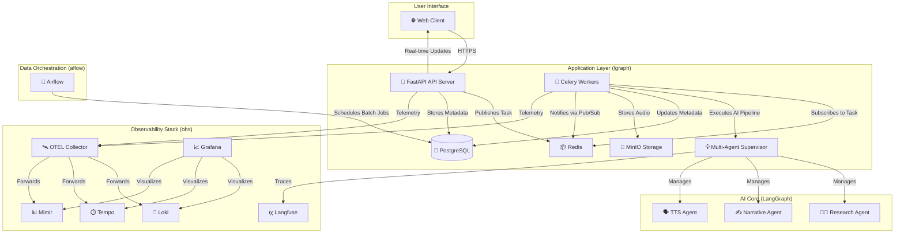

# LGraph: AI 기반 팟캐스트 제작 시스템

LGraph는 사용자가 제시한 주제를 바탕으로 AI 멀티 에이전트가 협력하여 완전한 형태의 한국어 팟캐스트를 제작하는 시스템입니다. 정보 수집부터 대본 작성, 음성 생성, 스트리밍까지 전 과정을 자동화합니다.

## ✨ 주요 기능

- **AI 멀티 에이전트 파이프라인**: `Research` → `Narrative` → `TTS` 역할을 수행하는 3개의 전문 에이전트가 LangGraph 기반의 Supervisor 패턴 하에 유기적으로 협력하여 팟캐스트 대본을 생성합니다.
- **비동기 작업 처리**: Celery와 Redis를 사용하여 무거운 AI 작업 및 파일 처리를 비동기적으로 수행하여 사용자 경험을 향상시킵니다.
- **실시간 진행 상황 알림**: WebSocket을 통해 클라이언트는 팟캐스트 생성 파이프라인의 각 단계(에이전트 실행, TTS 생성 등)에 대한 진행 상황을 실시간으로 피드백 받습니다.
- **스크립트 수정 및 음성 재성성**: AI가 생성한 스크립트를 사용자가 직접 수정하고, 전체 파이프라인을 재실행할 필요 없이 TTS 음성만 효율적으로 다시 생성할 수 있습니다.
- **HLS 스트리밍**: 생성된 음성 파일을 HTTP Live Streaming(HLS) 형식으로 제공하여 안정적인 오디오 재생을 지원합니다.
- **오브저버빌리티**: OpenTelemetry, Langfuse, Grafana, Loki, Prometheus 등을 활용한 포괄적인 모니터링 환경을 구축하여 시스템의 상태와 성능, AI 에이전트의 동작을 심층적으로 추적하고 분석할 수 있습니다.
- **유연한 프롬프트 관리**: 프롬프트를 코드와 분리된 마크다운 파일로 관리하며, 애플리케이션 재시작 없이 동적으로 리로드할 수 있습니다.

## 🏗️ 시스템 아키텍처

LGraph는 여러 마이크로 서비스가 유기적으로 결합된 MSA(Microservice Architecture) 구조를 따릅니다.



### 컴포넌트 설명

| 서비스              | 역할                                                                                                     | 기술 스택                                                      |
| ------------------- | -------------------------------------------------------------------------------------------------------- | -------------------------------------------------------------- |
| **FastAPI API**     | 사용자 요청 처리, 인증, 비동기 작업 생성, 실시간 상태 알림(WebSocket)                                      | FastAPI, Uvicorn                                               |
| **Celery Workers**  | AI 파이프라인 실행, TTS 생성, HLS 변환 등 무거운 백그라운드 작업 처리                                        | Celery                                                         |
| **PostgreSQL**      | 사용자, 작업, 에이전트 결과, 스크립트 등 모든 메타데이터 저장                                                | PostgreSQL, SQLAlchemy                                         |
| **Redis**           | Celery의 메시지 브로커 및 실시간 알림을 위한 Pub/Sub 채널 역할                                               | Redis                                                          |
| **MinIO**           | 생성된 오디오 파일(MP3/WAV) 및 HLS 스트리밍 세그먼트 저장                                                    | MinIO                                                          |
| **LangGraph Agents**| **(AI Core)** 주제 연구, 대본 작성, TTS 최적화를 수행하는 멀티 에이전트 시스템                              | LangChain, LangGraph, OpenAI                                   |
| **Observability**   | **(모니터링)** 시스템의 로그, 메트릭, 트레이스를 수집, 저장, 시각화                                          | OpenTelemetry, Grafana, Loki, Mimir, Tempo, Promtail           |
| **Langfuse**        | **(AI 추적)** LLM 호출 및 에이전트 상호작용을 시각적으로 추적하고 디버깅                                    | Langfuse                                                       |
| **Airflow**         | **(데이터 파이프라인)** 정기적인 배치(Batch) 작업이나 복잡한 데이터 파이프라인을 스케줄링하고 실행 (옵션) | Apache Airflow                                                 |


## 🚀 시작하기

### 요구사항

- Docker
- Docker Compose

### 설치 및 실행

1.  **리포지토리 클론**
    ```bash
    git clone https://github.com/naseongmin/trender.git
    cd trender
    ```

2.  **환경 변수 설정**
    `lgraph` 디렉토리 내에 `.env` 파일을 생성하고 필요한 환경 변수를 설정합니다. 주로 OpenAI API 키 및 Langfuse 관련 키가 필요합니다.

    ```bash
    # lgraph/.env

    # OpenAI API Key
    OPENAI_API_KEY="sk-..."

    # Langfuse (Optional, for tracing)
    LANGFUSE_PUBLIC_KEY="pk-lf-..."
    LANGFUSE_SECRET_KEY="sk-lf-..."
    LANGFUSE_HOST="https://cloud.langfuse.com"
    ```

3.  **애플리케이션 실행 (lgraph)**
    `lgraph` 디렉토리에서 Docker Compose를 사용하여 애플리케이션 스택을 실행합니다.

    ```bash
    cd lgraph
    docker-compose up --build
    ```
    이 명령은 API 서버, Celery 워커, PostgreSQL, Redis, MinIO 등 모든 서비스를 시작합니다.

4.  **오브저버빌리티 스택 실행 (obs)**
    `obs` 디렉토리에서 Docker Compose를 사용하여 모니터링 스택을 실행합니다.

    ```bash
    cd obs
    docker-compose up --build
    ```

### 서비스 접근

- **API Docs (Swagger UI)**: `http://localhost:8000/docs`
- **Celery Monitor (Flower)**: `http://localhost:5555`
- **MinIO Console**: `http://localhost:9001` (기본 계정: `minioadmin` / `minioadmin123`)
- **Grafana**: `http://localhost:3000`

## 📝 API 개요

주요 API 엔드포인트는 다음과 같습니다. 상세 내용은 Swagger UI (`/docs`)를 참고하세요.

- `POST /podcast/create`: 새로운 팟캐스트 생성 작업을 시작합니다.
- `GET /podcast/tasks`: 사용자의 팟캐스트 작업 목록을 조회합니다.
- `GET /podcast/tasks/{task_id}`: 특정 작업의 상세 정보(에이전트 결과 포함)를 조회합니다.
- `PUT /podcast/tasks/{task_id}/regenerate`: 수정된 스크립트로 음성을 다시 생성합니다.
- `GET /hls/{task_id}/master.m3u8`: 생성된 팟캐스트를 HLS 스트림으로 재생합니다.
- `WS /ws/{user_id}`: 실시간 진행 상황 알림을 위한 WebSocket 연결.
- `POST /auth/register`: 사용자 회원가입
- `POST /auth/login`: 사용자 로그인

## 🤝 기여

이 프로젝트는 지속적으로 발전하고 있습니다. 기여에 관심이 있으시면 이슈를 생성하거나 Pull Request를 보내주세요.

## 📄 라이선스

이 프로젝트는 [MIT License](LICENSE)를 따릅니다.
