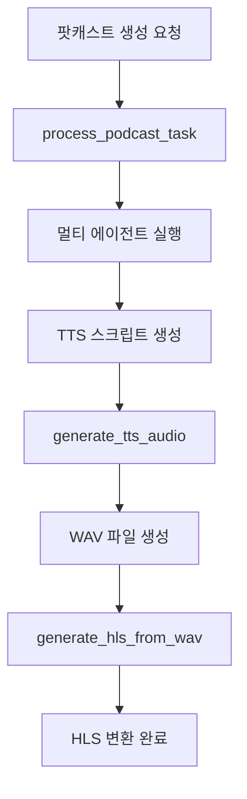

# LGraph Celery Tasks Module

이 디렉토리는 LGraph 시스템의 모든 Celery 태스크들을 기능별로 모듈화하여 관리합니다.

## 📁 구조

```
tasks/
├── __init__.py              # 모든 태스크 모듈 import
├── celery_config.py         # 공통 Celery 앱 설정
├── utils.py                 # 공통 유틸리티 함수들
├── podcast_tasks.py         # 팟캐스트 생성 관련 태스크
├── tts_tasks.py            # TTS 음원 생성 관련 태스크
├── hls_tasks.py            # HLS 변환 관련 태스크
└── README.md               # 이 파일
```

## 🎯 태스크 목록

### 1. 팟캐스트 관련 태스크 (`podcast_tasks.py`)
- `process_podcast_task`: 멀티 에이전트 팟캐스트 생성 파이프라인

### 2. TTS 관련 태스크 (`tts_tasks.py`)
- `generate_tts_audio`: WAV 음원 생성

### 3. HLS 관련 태스크 (`hls_tasks.py`)
- `generate_hls_from_wav`: WAV → HLS 변환

## 🔄 작업 흐름



## 🛠️ 개발 가이드

### 새로운 태스크 추가
1. 해당 기능 카테고리의 파일에 태스크 함수 추가
2. `__init__.py`의 `__all__` 리스트에 함수명 추가
3. 필요시 `celery_app.py`에서 import 추가

### 공통 유틸리티 추가
- `utils.py`에 공통 함수 추가
- 다른 태스크 파일에서 import하여 사용

### 태스크 간 의존성
- 지연 import 사용으로 순환 참조 방지
- 예: `from .tts_tasks import generate_tts_audio`

## 📊 장점

### 이전 (단일 파일)
- `celery_app.py`: **612줄** 😰
- 가독성 저하
- 유지보수 어려움
- 기능별 분리 없음

### 현재 (모듈화)
- `celery_app.py`: **41줄** ✨ (93% 감소)
- `podcast_tasks.py`: **230줄**
- `tts_tasks.py`: **138줄**  
- `hls_tasks.py`: **131줄**
- `utils.py`: **156줄**
- `celery_config.py`: **25줄**

### 개선 효과
✅ **가독성 향상**: 기능별로 명확히 분리
✅ **유지보수 용이**: 각 기능을 독립적으로 수정 가능
✅ **코드 재사용**: 공통 유틸리티 함수 분리
✅ **테스트 용이**: 개별 모듈별 테스트 가능
✅ **확장성**: 새로운 태스크 추가 시 해당 모듈에만 집중

## 🚀 실행

```bash
# Celery Worker 시작
celery -A celery_app worker --loglevel=info

# 특정 태스크만 실행
celery -A celery_app worker --loglevel=info -Q podcast_queue

# 태스크 목록 확인
python celery_app.py
``` 